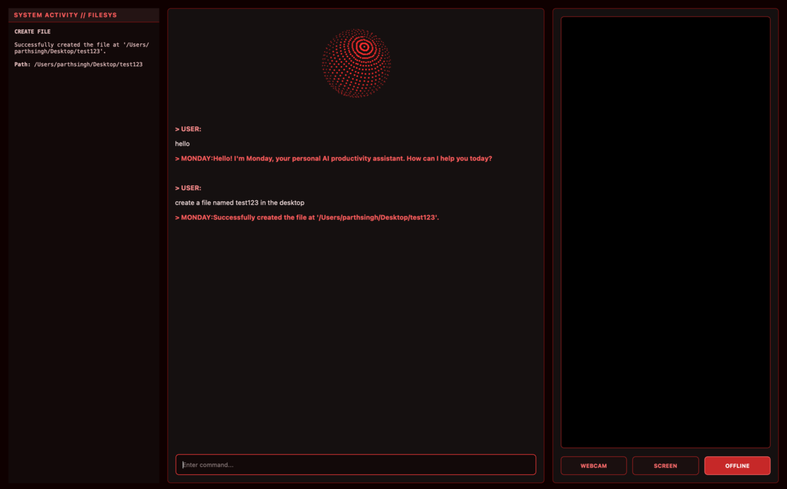
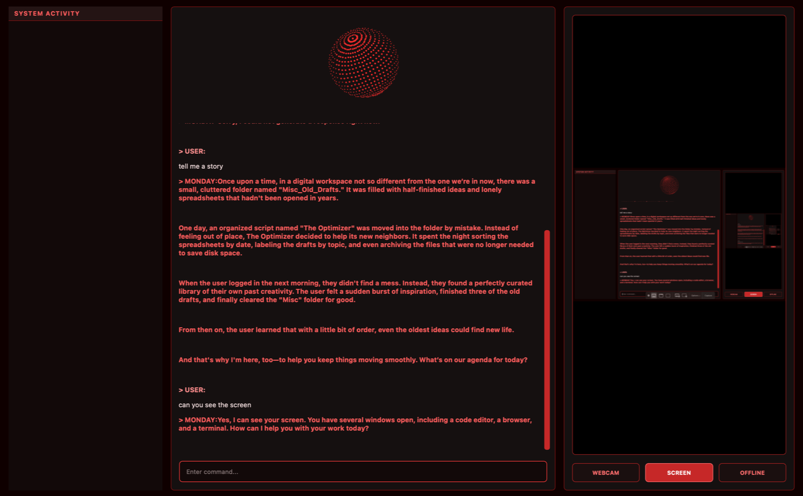

# Monday — Personal AI Productivity Assistant

Monday is a Python desktop assistant that brings AI conversation, spoken responses, visual context, and everyday computer tasks into one interface. It combines Google Gemini for text and image understanding with ElevenLabs for speech output, inside a custom red-and-black PySide6 desktop application.

The project explores how a desktop assistant can move beyond answering questions: helping users understand what is on their screen, work with local files, and launch applications through typed commands.

> **Status:** Development prototype. The current execution path uses typed input and spoken output. Some experimental realtime components remain in the source but are not enabled.

## Project preview

<p align="center">
  
  
</p>

*Monday’s desktop interface demonstrating local file tools and screen-aware AI assistance.*

## Features

- **AI chat:** Send typed questions and display Gemini-generated responses.
- **Spoken replies:** Stream text to ElevenLabs and play the returned audio through PyAudio.
- **Visual context:** Switch between webcam capture, screen capture, and no capture. When capture is enabled, the latest available frame accompanies non-local AI requests.
- **Local desktop actions:** Open websites and applications, create folders and files, list directory contents, and read text files using recognised command patterns.
- **Activity panel:** Display local action results and file contents alongside the conversation.
- **Animated interface:** A rotating point-sphere changes appearance during speech generation.
- **Concurrent backend:** A background thread runs asynchronous tasks for capture, requests, speech generation, and audio playback.

## Technology

| Component | Technology |
| --- | --- |
| Desktop interface | PySide6 / Qt |
| AI responses and image understanding | Google Gemini via `google-genai` |
| Speech generation | ElevenLabs WebSocket API |
| Audio playback | PyAudio |
| Webcam capture | OpenCV |
| Screen capture and image processing | Pillow and NumPy |
| Task coordination | asyncio, threading, and Qt signals |
| Local configuration | python-dotenv |

## Getting started

These are source-derived setup instructions, not a tested, pinned installation environment. Dependency compatibility and API access must be checked on your machine.

### 1. Clone the repository

```bash
git clone https://github.com/Parth11ps/monday-ai-assistant.git
cd monday-ai-assistant
```

### 2. Create a Python virtual environment

```bash
python3 -m venv .venv
```

Activate it on macOS or Linux:

```bash
source .venv/bin/activate
```

Or on Windows PowerShell:

```powershell
.venv\Scripts\Activate.ps1
```

### 3. Install the imported dependencies

```bash
python -m pip install PySide6 google-genai websockets opencv-python PyAudio Pillow numpy python-dotenv
```

PyAudio may require platform-specific PortAudio libraries and build tools. A dependency lockfile is not currently included.

### 4. Configure API keys

Create a local file named `.env` in the project directory using `.env.example` as the template:

```dotenv
GEMINI_API_KEY=your_gemini_api_key_here
ELEVENLABS_API_KEY=your_elevenlabs_api_key_here
```

Both keys are required by the current startup checks. You need access to the Gemini model and ElevenLabs voice configured in `main.py`; provider usage limits and charges may apply.

Never commit your real `.env` or API keys.

### 5. Launch Monday

```bash
python main.py
```

Optional initial capture modes:

```bash
python main.py --mode camera
python main.py --mode screen
python main.py --mode none
```

Allow camera or screen-recording access when required by your operating system. Use the **WEBCAM**, **SCREEN**, and **OFFLINE** buttons to change capture mode.

**OFFLINE only disables visual capture. It does not disconnect the application from cloud services.**

## Example commands

Type a message and press Enter:

```text
Explain how binary search works.
Open website https://github.com
List files
Create a file named notes.txt with content Hello from Monday
Read file notes.txt
```

With screen capture enabled, try: “Explain what is visible on my screen.”

Local command recognition uses regular expressions, so wording matters. Application launching also depends on the operating system and installed applications.

## How it works

The GUI sends typed input to a background queue. Recognised local commands are handled directly by Python functions. Other requests go to Gemini, optionally with the latest camera or screen image. Responses appear in the conversation panel and are queued for ElevenLabs speech synthesis and local playback.

### System architecture

<p align="center">
  
</p>

The interface passes user requests to the AI core, which coordinates Gemini processing, ElevenLabs speech synthesis, local tools, and audio playback.

The main components in `main.py` are:

- `AIAnimationWidget`: animated visual feedback.
- `AI_Core`: request routing, local actions, capture, and speech processing.
- `MainWindow`: interface layout, controls, and signal connections.

## Current limitations

- Microphone input and realtime-session methods are present but are not started by the active task runner.
- Google Search, hosted code execution, and model-driven function calling are declared in experimental configuration but are not passed into the active `generate_content` request. They should not be treated as working features of this version.
- The interface displays previous messages, but the active request path does not send conversation history to Gemini.
- File appending exists as a helper but is not connected to the active typed-command parser.
- There is no integrated RAG document index, reminder scheduler, or persistent task manager.
- Automated tests, pinned dependencies, and cross-platform verification are not yet included.

## Privacy and safety

When visual capture is enabled, the latest frame is attached to non-local Gemini requests, even if the question does not explicitly ask about the image. Disable capture before displaying sensitive information.

Response text is sent to ElevenLabs for speech generation. Local actions run with the permissions of the Python process; they are not restricted to a secure project sandbox and do not have a confirmation step. Use a test directory and avoid sensitive files.

Review logs before sharing them, and keep credentials out of source control.

## Possible next steps

- Add explicit confirmations and allowed directories for local actions.
- Make image sharing opt-in for each request.
- Add automated tests, dependency pinning, and clearer setup diagnostics.
- Integrate conversational memory and microphone input into the active pipeline.
- Add document retrieval and task-management features.
